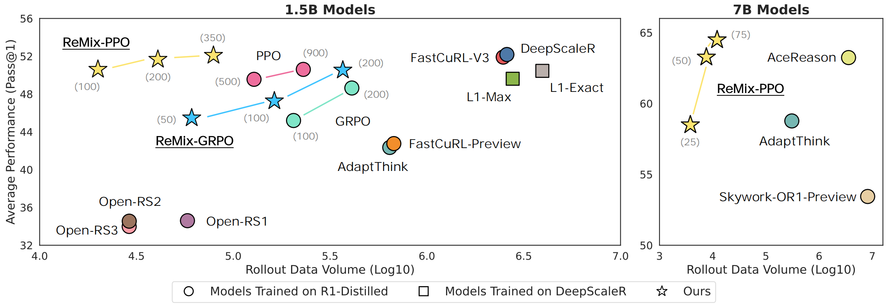

<div align="center">

# ReMix: Reincarnating Mix-policy Proximal Policy Gradient

<div>
🧽 Squeeze the Soaked Sponge 🌊
Efficient Off-policy Reinforcement Finetuning for Large Language Model
</div>
</div>
<div>
<br>

<div align="center">

[](https://anitaleungxx.github.io/ReMix/)
[](https://arxiv.org/abs/2507.06892)
[](https://x.com/tanghyyy/status/1945115969753362455?s=46https://x.com/tanghyyy/status/1945115969753362455?s=46)
[](https://huggingface.co/collections/AnitaLeung/remix-68731af37a4e585e69c18aa2)

</div>

</div>


**ReMix** (**Re**incarnating **Mix**-policy Proximal Policy Gradient) is a general approach to enable on-policy RFT methods like PPO and GRPO to leverage off-policy data.


<p align='center'>

</p>

## 📰 News

<strong>[2025/08/30]</strong> We release [`Remix-R1-Distilled-Qwen-1.5B`](https://huggingface.co/AnitaLeung/Remix-R1-Distilled-Qwen-1.5B) and [`Remix-R1-Distilled-Qwen-7B`](https://huggingface.co/AnitaLeung/Remix-R1-Distilled-Qwen-7B), the checkpoints of the ReMix-PPO reported in our paper. We also release a ready-to-use [`evaluation scripts`] that reproduces all benchmark results.

<strong>[2025/07/11]</strong> We release paper [`Squeeze the Soaked Sponge: Efficient Off-policy Reinforcement Finetuning for Large Language Model`](https://arxiv.org/pdf/2507.06892) presenting <strong>ReMix</strong>, a simple yet effective approach that equips on-policy proximal policy gradient methods (eg. PPO and GRPO) with off-policy replay to slash LLM reasoning-finetuning costs while setting new SOTA math performance and, for the first time, exposing how off-policy RL shapes the emergence of reasoning behaviors.

## 🌠 Key Results
Below are the pass@1 results of our models versus all baselines on five benchmarks (all greedy unless noted). For AIME, the column additionally reports “/temperature-0.1(avg@32)” to account for its small size and high variance.

In the table, “cost” refers to the total rollout data volume generated during training. Rollout data volume defined as the total number of rollouts generated by the model during the training process. It reflects the total amount of model inference, which is usually \textbf{the dominant source} of computational cost during training.

### 1.5B MODELS
| Model | AIME 24 | AMC 23 | MATH 500 | Minerva | OlympiadBench | Avg. | Cost |
|-------|-----------|-----------|-----------|--------------|---------------|------|-----------|
| R1-Distill-Qwen-1.5B (Base) | 33.33/18.54 | 43.37/44.58 | 67.40/67.40 | 16.54/17.28 | 27.26/29.19 | 37.58/35.27 | N/A |
| Open-RS1 | 23.33/19.58 | 42.17/45.44 | 64.20/68.00 | 16.18/19.49 | 27.11/29.26 | 34.60/35.91 | 0.058M |
| Open-RS2 | 16.67/20.31 | 45.78/44.92 | 65.00/68.40 | 18.38/17.65 | 26.96/28.15 | 34.56/35.35 | 0.029M |
| Open-RS3 | 16.67/19.69 | 44.58/43.98 | 67.60/67.40 | 15.64/19.12 | 25.48/28.15 | 33.99/35.46 | 0.029M |
| AdaptThink | 13.33/19.06 | 57.83/56.81 | 78.60/76.80 | 23.90/23.90 | 38.07/37.93 | 42.35/42.90 | 0.643M |
| II-Thought | 26.67/28.65 | 56.63/59.72 | 73.00/77.80 | 23.16/23.16 | 40.89/42.37 | 44.07/46.34 | - |
| FASTCuRL-preview | 26.67/25.94 | 60.24/54.27 | 74.20/74.20 | 20.22/21.69 | 32.59/37.04 | 42.78/42.63 | 0.676M |
| FASTCuRL-V3 | 36.67/33.44 | 66.27/63.63 | 84.40/83.40 | 28.67/28.31 | 43.56/44.59 | 51.91/50.67 | 2.478M |
| L1-Exact* | 23.33/25.10 | 71.08/66.57 | 84.00/84.20 | 29.41/26.84 | 44.59/44.3 | 50.48/49.40 | 3.953M |
| L1-Max* | 20.00/23.13 | 69.88/66.79 | 83.00/84.00 | 29.04/27.57 | 46.37/44.44 | 49.66/49.19 | 2.764M |
| DeepScaleR | 40.00/31.96 | 65.06/63.58 | 83.20/81.20 | 29.04/26.1 | 43.41/41.33 | 52.14/48.83 | 2.519M |
| <strong>ReMix</strong> | 36.67/29.08 | 69.88/64.04 | 82.00/83.80 | 30.15/29.04 | 41.78/42.67 | 52.10/49.73 | 0.079M |

### 7B MODELS
| Model | AIME 24 | AMC 23 | MATH 500 | Minerva | OlympiadBench | Avg. | Cost |
|-------|-----------|-----------|-----------|--------------|---------------|------|-----------|
| R1-Distill-Qwen-7B (Base) | 33.33/37.53 | 68.68/66.55 | 83.80/84.80 | 30.15/32.72 | 44.44/43.41 | 52.08/53.00 | N/A |
| ReasonFlux-F1 | 20.00/20.19 | 54.22/53.07 | 77.20/79.60 | 29.04/31.99 | 37.04/38.81 | 43.50/44.77 | - |
| Light-R1 | 30.00/40.00 | 66.27/66.73 | 87.00/86.8 | 34.56/31.62 | 47.56/48.30 | 53.08/54.69 | - |
| Skywork-OR1-Preview | 43.33/36.31 | 63.86/61.60 | 84.40/83.40 | 29.41/31.25 | 46.22/43.85 | 53.44/51.28 | >8.192M |
| Polaris | 40.00/39.71 | 63.86/67.40 | 87.60/86.40 | 36.40/34.19 | 48.00/48.30 | 55.17/55.20 | - |
| AdaptThink | 46.67/47.62 | 75.90/74.20 | 87.60/87.00 | 33.46/34.56 | 50.22/50.52 | 58.77/58.78 | 0.307M |
| AceReason-Nemotron | 60.00/50.00 | 80.72/77.48 | 89.00/89.60 | 36.40/35.29 | 50.07/53.85 | 63.24/60.99 | >3.584M |
| <strong>ReMix-PPO</strong> | 63.33/50.31 | 78.31/77.78 | 90.20/91.00 | 37.50/37.87 | 52.59/52.89 | 64.39/61.97 | 0.011M |

## 🖋️ Installation

```bash

conda create -n remix python=3.9
pip install torch==2.4.0 --index-url https://download.pytorch.org/whl/cu121

# install vllm
pip3 install vllm==0.6.3 # or you can install 0.5.4, 0.4.2 and 0.3.1
pip3 install ray

# verl
pip install -e .

# flash attention 2
pip3 install flash-attn --no-build-isolation
# quality of life
pip install wandb IPython matplotlib

```

## 🔬 Evaluation

1. Run evaluation
❗️ If you wanna do greedy decoding, please set DO_SAMPLE as False.
```bash

export DO_SAMPLE=True

# temperature
export TEMP=0.3
# number of runs
export TOTAL_RUNS=4

# benchmark
export DATA=math

# max response length
export LENGTHM=8192

# model
export BASE_MODEL_NAME=./model/DeepSeek-R1-Distill-Qwen-7B

bash ./scripts/evaluate_1.5b.sh
# or bash ./scripts/evaluate_7b.sh
```
The evaluation results can be found in ./tmp/logs, and the model’s generation outputs are saved as parquet files under ./test.parquet.

2. Caculate the avg@TOTAL_RUNS

```bash
export DATA=math
python ./avg.py
```
## ✍️ Acknowledgements

-Our implementation builds on the [verl](https://github.com/volcengine/verl) RL framework; we forked the [TinyZero](https://github.com/Jiayi-Pan/TinyZero) repository and adopted the [DeepScaleR](https://github.com/rllm-org/rllm) reward functions for math tasks.
- Our models are trained on top of [`DeepSeek-R1-Distill-Qwen-1.5B`](https://huggingface.co/deepseek-ai/DeepSeek-R1-Distill-Qwen-1.5B), [`DeepSeek-R1-Distill-Qwen-7B`](https://huggingface.co/deepseek-ai/DeepSeek-R1-Distill-Qwen-7B).

## 📎 Citation

If you find ReMix helpful, please cite us.

```bibtex
@article{liang2025squeezesoakedspongeefficient,
      title={Squeeze the Soaked Sponge: Efficient Off-policy Reinforcement Finetuning for Large Language Model}, 
      author={Jing Liang and Hongyao Tang and Yi Ma and Jinyi Liu and Yan Zheng and Shuyue Hu and Lei Bai and Jianye Hao},
      journal={arXiv preprint arXiv:2507.06892},
      url={https://arxiv.org/abs/2507.06892}, 
      year={2025}
}
```
